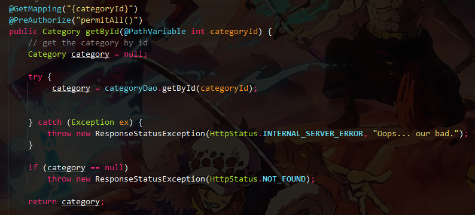

# EasyShop Final Capstone
Welcome to the EasyShop Online store! This java-based project is designed to make online purchases.
No need to go outside spend half a day shopping outside when you could do all that in a matter of 
minutes from a mobile device or a laptop. 

## Technologies Used ⚙ ⚒
1.Java: The core programming language used for developing the application. Java's versatility and object-oriented features contribute to the robustness of the codebase.

2.Git: Utilized Git as the version control system for tracking changes, managing branches, and enabling collaborative development.

3.Postman: Postman's Node. js-based runtime contains support for common patterns and libraries that you can use to build tests quickly.

4.MySQL: MySQL is a popular, time-tested, but also modern and fully-featured relational database management software.

5.Spring REST:Spring Data REST is part of the umbrella Spring Data project and makes it easy to build hypermedia-driven REST web services on top of Spring Data repositories.

6.Spring Boot: Spring Boot is an open-source, microservice-based Java web framework offered by Spring, particularly useful for software engineers developing web apps and microservices. 

## Demo 📽g

This gif shows that our code has no bugs

This gif shows what the application is up and running

This is one of the methods that we had to create to get the category of an item by its Id.
## Resources 📚📑
1.GitHub Repository: The repository served as the central hub for collaboration, version control, and documentation of the project.

2.Raymond Maroun's GitHub: https://github.com/RayMaroun

3.ASCII FLOW.

4.Discord: Discord is a popular communication platform among gamers and other online communities. Easy navigation and comfortability are key to enhancing effective communication.

